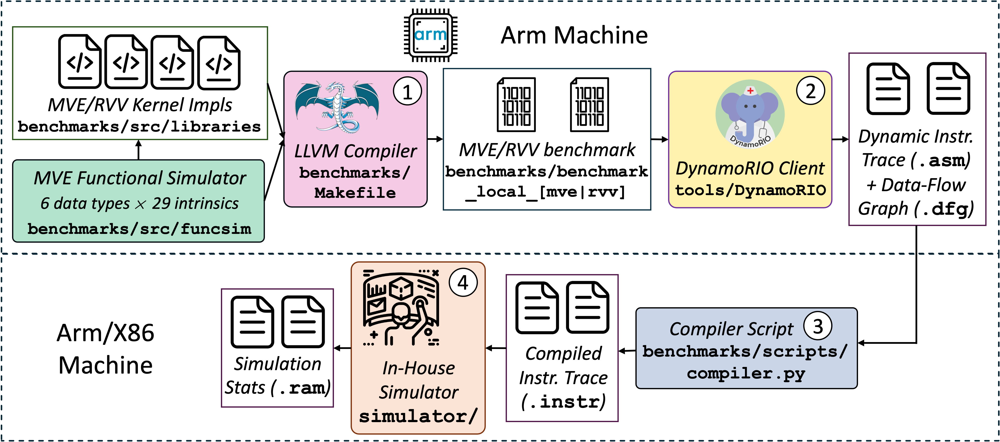

# Artifcat of the MVE Paper, HPCA 2025

This repository provides the codes, tools, and scripts required for the artifact evaluation of the **MVE**, "Multi-Dimensional Vector ISA Extension for Mobile In-Cache Computing" paper published in HPCA 2025.

This evaluation is based on Samsung Galaxy S10e device, equipped with Snapdragon 855 mobile SoC and Armv8.2-A ISA.

## Directory structure

The repo structure is as followed:
  - [simulator](/simulator/) is our trace-driven simulator for various in-SRAM computing schemes, such as Bit-Serial (BS), Bit-Hybrid (BH), Bit-Parallel (BP), and Associative Computing (AC). Refer to [its readme](/simulator/README.md) for more information.
  - [benchmarks](/benchmarks/) provides various implementations and scripts for the evaluated data-parallel workloads from the Swan benchmark suite \[1\]. Refer to [its readme](/benchmarks/README.md) for more information.
  - [tools](/tools/) contain the OpenCL SDK header files and library for Adreno GPU evaluation, and DynamoRIO client for trace generation.

## Dependencies

Phone measurements and simulation infrastructure requires the folllowing tools:

  - Download and install [Android Debug Bridge (adb)](https://developer.android.com/tools/adb) for the shell access to the Android phone.
  - Download [Android NDK r23c](https://github.com/android/ndk/wiki/Unsupported-Downloads) for cross compilation and extract it.
  - Use the provided [Adreno OpenCL SDK v1.5](/tools/opencl-sdk-1.5.zip) and [Adreno OpenCL shared library](/tools/libopencl) for Adreno mobile GPU evaluation.
  - Use the provided [DynamoRIO client](/tools/DynamoRIO/) for generating the simulation traces on an Arm machine.
  
## Cloning the Repository

This repository contains large dynamic instruction and data flow graph files (~2.5GB) located in the [data](/data/) directory. These files allow you to skip Steps 1 and 2 of the [Simulation Workflow](#simulation-workflow).

There are two recommended ways to clone the repository and access these files:

**Git LFS:**  These files are stored as Git LFS objects. To ensure the large files are downloaded during cloning, please install [Git LFS](https://git-lfs.com/) before cloning the repository:

```bash
# Install Git LFS
git clone https://github.com/arkhadem/MVE.git
cd MVE
export MVE_HOME=$(pwd)
```

**Manual Download:** The data files are also available on our local servers. You can use the script below to clone the repository and download the files manually:

```bash
# Set the following environment variable to disable Git LFS
export GIT_LFS_SKIP_SMUDGE=1
git clone https://github.com/arkhadem/MVE.git
cd MVE
export MVE_HOME=$(pwd)
bash ./data/download.sh
```

## Build

Run the following bash script to set up the cross-compilation infrastructure and compile the Arm Neon and Adreno GPU baselines.

```bash
export ANDROID_NDK_ROOT=path/to/android-ndk-r23c
cp -r $MVE_HOME/tools/opencl-sdk-1.5/inc/CL $ANDROID_NDK_ROOT/toolchains/llvm/prebuilt/linux-x86_64/sysroot/usr/include/
cp $MVE_HOME/tools/libopencl/libOpenCL.so $ANDROID_NDK_ROOT/toolchains/llvm/prebuilt/linux-x86_64/lib/
cd $MVE_HOME/benchmarks
make phone_neon -j
make phone_adreno -j
```

Install the DynamoRIO client on a machine with Armv8.2-A ISA using the following script:

```bash
cd $MVE_HOME/tools/DynamoRIO/samples
mkdir build
cd build
cmake ..
make -j
```

Build the simulator using the following script:

```bash
cd $MVE_HOME/simulator
bash make_all.sh
```

## Measurement Workflow

Run the following provided scripts to automatically generate the single-core Arm Neon (`neon.csv`) and Adreno mobile GPU (`adreno.csv`) results:

```bash
cd $MVE_HOME/benchmarks
python scripts/profiler.py --measurement performance --platform neon --core prime --output neon.csv
python scripts/profiler.py --measurement performance --platform adreno --core prime --output adreno.csv
```

Use `--verbose` to checkout the measurement logs.

## Simulation Workflow

Our simulator is trace-driven, which requires generating the required instruction trace files.
Simulation is performed in 4 steps for every ISA (MVE and RVV) and in-cache computing scheme (BS, BH, BP, and AC) combination as shown by the following figure.
  - **Step 1** builds the MVE and RVV baselines.
  - **Step 2** runs the MVE and RVV benchmarks and use the DynamoRIO client to generate a dynamic instruction trace (`.asm`) and a data-flow graph (`.dfg`) file for each kernel.
  - **Step 3** compiles these files to the instruction traces (`.instr`) for the simulator.
  - **Step 4** runs the simulator and generates the simulation results (`.ram`).
Finally, scripts are provided to parse the simulation results and generate the CSV files (`{ISA}_{scheme}.csv`).



Use the following bash script for these steps:

```bash
cd $MVE_HOME/benchmarks
# Step 1: building the MVE and RVV kernels
make local_mve -j
make local_rvv -j
source ./set_env.sh
# Step 2: running DynamoRIO's instrumentation tool
python scripts/simulator.py --action benchmark --directory ./data
# Step 3: compiling asm and dfg files into sim traces
python scripts/simulator.py --action compile --directory ./data
# Step 4: running the simulations
python scripts/simulator.py --action simulate --directory ./data
# Parsing the results
python scripts/simulator.py --action parse --directory ./data
```

Use `--verbose` to check the detail logs of every step, and `-j [NUM_THREADS]` to set the number of concurrent simulations in step 3.

## Citation

If you use *MVE*, please cite this paper:

> Alireza Khadem, Daichi Fujiki, Hilbert Chen, Yufeng Gu, Nishil Talati, Scott Mahlke, and Reetuparna Das.
> *Multi-Dimensional Vector ISA Extension for Mobile In-Cache Computing*,
> In 2025 IEEE International Symposium on High-Performance Computer Architecture (HPCA)

```
@inproceedings{mve,
  title={Multi-Dimensional Vector ISA Extension for Mobile In-Cache Computing},
  author={Khadem, Alireza and Fujiki, Daichi and Chen, Hilbert and Gu, Yufeng and Talati, Nishil and Mahlke, Scott and Das, Reetuparna},
  booktitle={2025 IEEE International Symposium on High-Performance Computer Architecture (HPCA)}, 
  year={2025}
}
```

## Issues and bug reporting

We appreciate any feedback and suggestions from the community.
Feel free to raise an issue or submit a pull request on Github.
For assistance in using MVE, please contact: Alireza Khadem (arkhadem@umich.edu)

## Licensing

This repository is available under a [MIT license](/LICENSE).
please refer to [Ramulator](https://github.com/CMU-SAFARI/ramulator), [Swan Benchmark Suite](https://github.com/arkhadem/Swan), and [DynamoRIO](https://github.com/DynamoRIO/dynamorio) for their corresponding licenses.

## References

\[1\] A. Khadem, D. Fujiki, N. Talati, S. Mahlke and R. Das, "Vector-Processing for Mobile Devices: Benchmark and Analysis," *2023 IEEE International Symposium on Workload Characterization (IISWC)*, Ghent, Belgium, 2023.

## Acknowledgement

This work was supported in part by the NSF under the CAREER-1652294 and NSF-1908601 awards and by JST PRESTO Grant Number JPMJPR22P7.